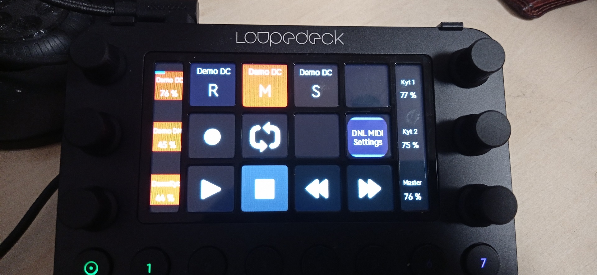

# DNL MIDI plugin for loupedeck

A plugin for Loupedeck for MIDI support:
* Mackie Control emulation, pulls track names from the DAW and displays them on the screen

* You'll need a virtual MIDI loopback driver, such as [loopMIDI](https://www.tobias-erichsen.de/software/loopmidi.html).
* Made by Danol.
* Uses Icons8.

## TODO
* Per channel solo/mute/arm
* Per channel command with touch gestures etc
* Time/position display
* Standard MIDI button
* Standard MIDI adjustment?
* MIDI Pad
	* Horizontal/vertical action:
		* Aftertouch volume
		* Sustain
		* Pitch bend
		* Modulation
	* Layout adjustment
	* Initial volume adjustment